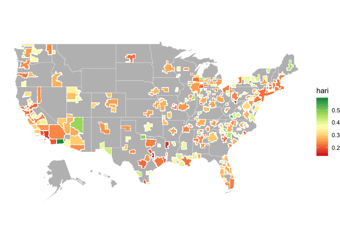

Basic Map EDA
================
Erik Strand
2020-02-20

``` r
library(tidyverse)
```

    ## ── Attaching packages ────────────────────────────────────────────────────────────────────────────────────────────── tidyverse 1.3.0 ──

    ## ✓ ggplot2 3.2.1     ✓ purrr   0.3.3
    ## ✓ tibble  2.1.3     ✓ dplyr   0.8.4
    ## ✓ tidyr   1.0.2     ✓ stringr 1.4.0
    ## ✓ readr   1.3.1     ✓ forcats 0.4.0

    ## ── Conflicts ───────────────────────────────────────────────────────────────────────────────────────────────── tidyverse_conflicts() ──
    ## x dplyr::filter() masks stats::filter()
    ## x dplyr::lag()    masks stats::lag()

``` r
library(sf)
```

    ## Linking to GEOS 3.7.2, GDAL 2.4.2, PROJ 5.2.0

``` r
# Parameters

  # File for HARI data
file_hari <- here::here("/data/hari.shp")

# ==============================================================================
  # Read in data
hari <- read_sf(file_hari)
```

``` r
states <- 
  ussf::boundaries(geography = "state") %>% 
  st_transform(crs = st_crs(hari))

hari %>% 
  ggplot(aes(fill = hari)) + 
  geom_sf(
    data = states, 
    # aes(geometry = geometry), 
    color = "white", 
    size = 0.1, 
    fill = "gray"
  ) + 
  geom_sf(
    aes(geometry = geometry), 
    color = "white", 
    size = 0.1
  ) + 
  scale_fill_gradientn(
    colors = RColorBrewer::brewer.pal(n = 9, name = "RdYlGn"), 
    na.value = "gray"
  ) + 
  theme_void()
```


