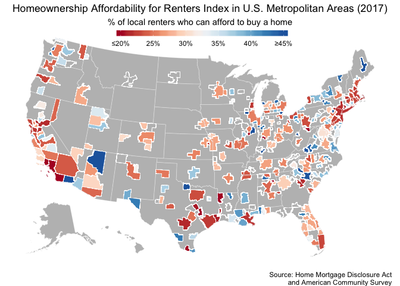
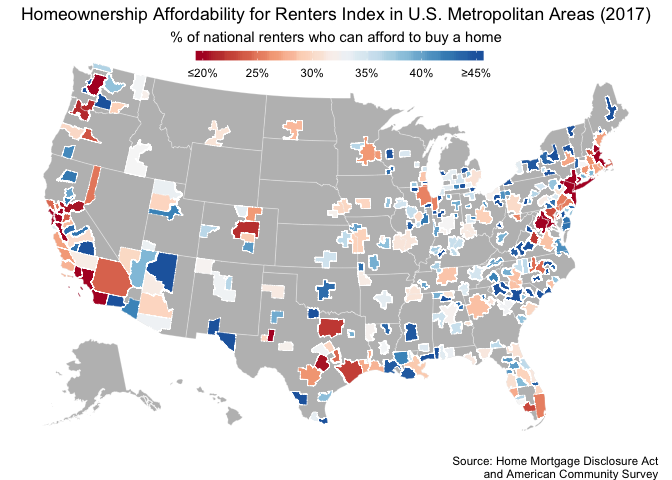
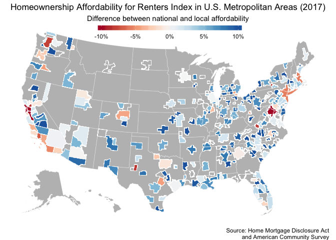
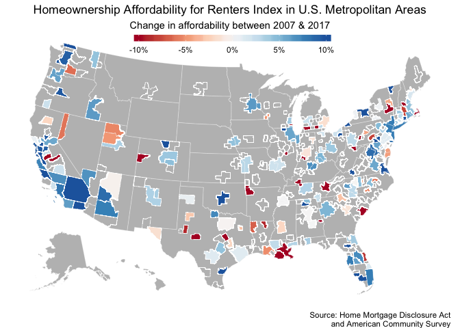
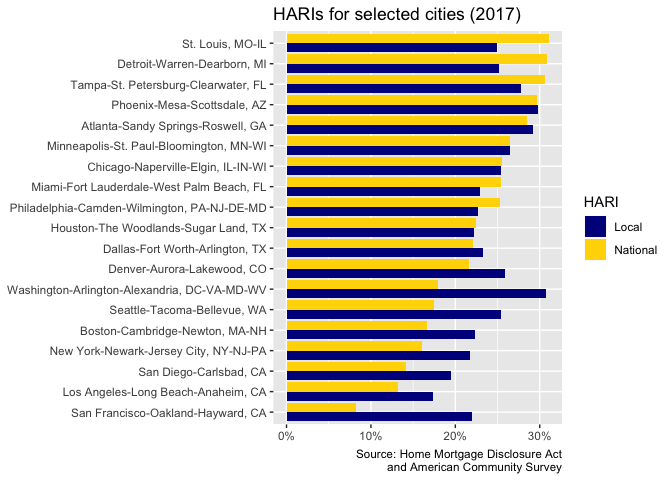
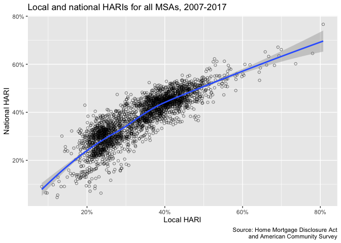
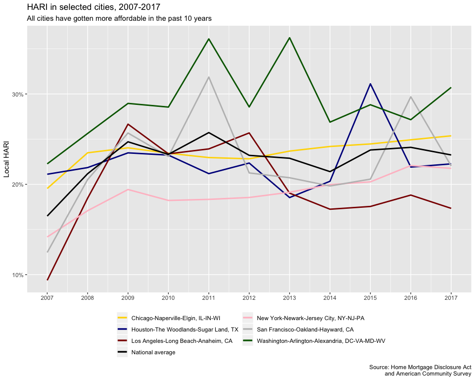
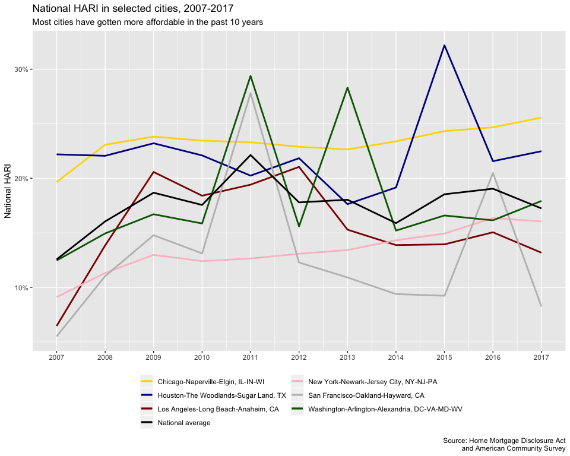
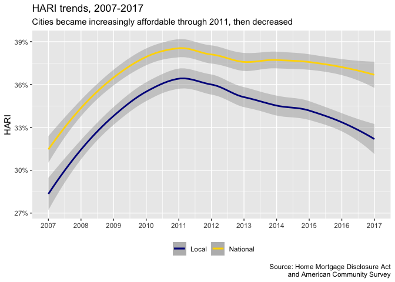

Final report
================
Erik Strand
2020-03-18

  - [Introduction](#introduction)
  - [Data and Methods](#data-and-methods)
      - [Data sources](#data-sources)
  - [Analysis & EDA](#analysis-eda)
      - [Maps](#maps)
      - [EDA](#eda)
  - [Conclusions](#conclusions)

## Introduction

Affordable housing is a significant challenge facing the United States
today. Half of the nation’s renters are rent burdened \[1\]. Many
renters are unable to afford to purchase a home. While homeownership in
some contexts, particularly standalone single-family homes, can cause
problems, owning property is also one of the most effective ways to
build equity and wealth. Particulary for communities historically
excluded from the homeownership market, buying a home is perhaps the
best way to close the wealth gap with those who have owned for
generations.

In this context, I have chosen to do my final project on the subject of
homeownership affordability. In this project, I recreate findings from a
[2018
report](https://www.urban.org/sites/default/files/publication/97496/housing_affordability_local_and_national_perspectives_1.pdf)
by Laurie Goodman, Wei Li, and Jun Zhu and published by the Urban
Institute.

This report influentially created a new metric for determining
homeownership affordability in metropolitan areas. The authors propose a
metric called the **Homeownership Affordability for Renters Index, or
HARI**. The HARI metric is produced for each of 290 Metropolitan
Statistical Areas (MSAs) in the U.S. The metric represents the
probability that a renter can afford to purchase a home in a given MSA.
One metric is calculated for renters living within that MSA, and a
second is given for all renters in the nation. Through the HARI, we can
see how affordable each city’s homeownership stock is to its own renters
as well as those nationwide.

The HARI has a few advantages over existing affordable
housing/homeownership metrics:

1.  The metric considers renters and owners at all income levels,
    whereas traditional metrics are based on the median incomes of
    renters and owners. This is highly advantageous because it more
    heavily considers people at the extremes of the income spectrum,
    particularly people with the lowest incomes who are most vulnerable
    in terms of housing.
2.  Affordability is determined in relation to empirical data from each
    city. In other words, HARI in a given year and city is determined
    using homeownership rates of people in different income brackets. By
    contrast, existing metrics tend to define affordable housing as that
    which costs 30% or less of a household’s income, as determined by
    the U.S. Department of Housing and Urban Development (HUD). HARI is
    advantageous to this method because income thresholds for
    homeownership may differ significantly from city to city.

## Data and Methods

The original report used a proprietary dataset compiled by the Urban
Institute to calculate their findings. Unfortunately, this dataset
wasn’t made publicly available. For the purposes of this project, I
recreated my best approximation of the original dataset used by the
authors. Due to this, my findings differ somewhat from the original
report.

### Data sources

My dataset compiles two main datasets:

1.  I use Housing Mortgage Disclosure Act (HMDA) data published annually
    by the [Consumer Finance Protection
    Bureau](https://www.consumerfinance.gov/data-research/hmda/historic-data/)
    for the years 2007-2017. This dataset provides information about
    originated mortages nationwide, which I use as a proxy for
    homeownership.
2.  I combine HMDA data with American Community Survey (ACS) data
    published by IPUMS (Integrated Public Use Microdata Survey). ACS
    data contains information regarding renter populations and incomes.

I aggregated each of these datasets at the MSA level and joined the two
by year, MSA and household income. In the process of doing so, I clumped
household income for both renters and owners into brackets ranging from
$0 to $250,000 in $10,000 increments (rounded down). This allowed me to
normalize and compare the data in meaningful bins. A sample of the
joined data appears as follows:

``` r
joined_acs_hmda %>% 
  head(n = 10L) %>% 
  kable()
```

<table>

<thead>

<tr>

<th style="text-align:right;">

year

</th>

<th style="text-align:right;">

msa\_code

</th>

<th style="text-align:right;">

hh\_inc\_bracket

</th>

<th style="text-align:right;">

owners

</th>

<th style="text-align:right;">

renters

</th>

</tr>

</thead>

<tbody>

<tr>

<td style="text-align:right;">

2007

</td>

<td style="text-align:right;">

10420

</td>

<td style="text-align:right;">

0

</td>

<td style="text-align:right;">

3

</td>

<td style="text-align:right;">

18419

</td>

</tr>

<tr>

<td style="text-align:right;">

2007

</td>

<td style="text-align:right;">

10420

</td>

<td style="text-align:right;">

10000

</td>

<td style="text-align:right;">

75

</td>

<td style="text-align:right;">

15996

</td>

</tr>

<tr>

<td style="text-align:right;">

2007

</td>

<td style="text-align:right;">

10420

</td>

<td style="text-align:right;">

20000

</td>

<td style="text-align:right;">

473

</td>

<td style="text-align:right;">

14623

</td>

</tr>

<tr>

<td style="text-align:right;">

2007

</td>

<td style="text-align:right;">

10420

</td>

<td style="text-align:right;">

30000

</td>

<td style="text-align:right;">

766

</td>

<td style="text-align:right;">

12301

</td>

</tr>

<tr>

<td style="text-align:right;">

2007

</td>

<td style="text-align:right;">

10420

</td>

<td style="text-align:right;">

40000

</td>

<td style="text-align:right;">

742

</td>

<td style="text-align:right;">

6765

</td>

</tr>

<tr>

<td style="text-align:right;">

2007

</td>

<td style="text-align:right;">

10420

</td>

<td style="text-align:right;">

50000

</td>

<td style="text-align:right;">

610

</td>

<td style="text-align:right;">

4613

</td>

</tr>

<tr>

<td style="text-align:right;">

2007

</td>

<td style="text-align:right;">

10420

</td>

<td style="text-align:right;">

60000

</td>

<td style="text-align:right;">

527

</td>

<td style="text-align:right;">

6000

</td>

</tr>

<tr>

<td style="text-align:right;">

2007

</td>

<td style="text-align:right;">

10420

</td>

<td style="text-align:right;">

70000

</td>

<td style="text-align:right;">

421

</td>

<td style="text-align:right;">

2914

</td>

</tr>

<tr>

<td style="text-align:right;">

2007

</td>

<td style="text-align:right;">

10420

</td>

<td style="text-align:right;">

80000

</td>

<td style="text-align:right;">

336

</td>

<td style="text-align:right;">

1632

</td>

</tr>

<tr>

<td style="text-align:right;">

2007

</td>

<td style="text-align:right;">

10420

</td>

<td style="text-align:right;">

90000

</td>

<td style="text-align:right;">

270

</td>

<td style="text-align:right;">

435

</td>

</tr>

</tbody>

</table>

Each MSA has an entry for each income bracket listing the number of
renters and homeowners in each year between 2007 and 2017.

Using this data, I calculated HARI for each MSA using the guidelines in
the original report. Five new variables were created:

  - `Proportion owners`: The number of owners by MSA in each income
    bracket as a percentage of the total number of owners in that MSA;
  - `Proportion renters`: The same calculation, for renters;
  - `Cumulative ownership probability`: A cumulative sum of `Proportion
    owners`. Represents the probability that a homeowner makes at or
    below each income bracket.
  - `Renter affordability`: `Proportion renters` \* `Cumulative
    ownership probability`. Represents the percentage of renters who can
    afford a home at or below each income bracket, based on the
    percentage of owners in the same bracket.
  - `HARI`: The cumulative sum of `Renter affordability`. The HARI at
    the highest income bracket represents the total percentage of
    renters in each MSA that can afford to buy a home there.

Additionally, I repeated these calculations for national HARI estimates.
I then joined the national and local calculations and added two new
variables to represent national HARIs:

  - `Renter afford national`: The national `Proportion renters` \* the
    local `Renter affordability`. This represents the percentage of
    national renters who can afford to buy a home in each MSA at each
    income bracket.
  - `HARI national`: The cumulative sum of `Renter afford national`.
    This is the HARI based on renters nationwide.

This long-form HARI shows all the intermediate steps used to calculate
the final HARI for each MSA:

``` r
hari_long %>% 
  head(n = 10L) %>% 
  kable()
```

<table>

<thead>

<tr>

<th style="text-align:right;">

year

</th>

<th style="text-align:right;">

msa\_code

</th>

<th style="text-align:right;">

hh\_inc\_bracket

</th>

<th style="text-align:right;">

owners

</th>

<th style="text-align:right;">

renters

</th>

<th style="text-align:right;">

owners\_prop

</th>

<th style="text-align:right;">

renters\_prop

</th>

<th style="text-align:right;">

cum\_prob

</th>

<th style="text-align:right;">

rntr\_afford

</th>

<th style="text-align:right;">

hari

</th>

<th style="text-align:right;">

renters\_prop\_ntl

</th>

<th style="text-align:right;">

rntr\_afford\_ntl

</th>

<th style="text-align:right;">

hari\_ntl

</th>

</tr>

</thead>

<tbody>

<tr>

<td style="text-align:right;">

2007

</td>

<td style="text-align:right;">

10420

</td>

<td style="text-align:right;">

0

</td>

<td style="text-align:right;">

3

</td>

<td style="text-align:right;">

18419

</td>

<td style="text-align:right;">

0.0005592

</td>

<td style="text-align:right;">

0.2147462

</td>

<td style="text-align:right;">

0.0005592

</td>

<td style="text-align:right;">

0.0001201

</td>

<td style="text-align:right;">

0.0001201

</td>

<td style="text-align:right;">

0.1388359

</td>

<td style="text-align:right;">

0.0000776

</td>

<td style="text-align:right;">

0.0000776

</td>

</tr>

<tr>

<td style="text-align:right;">

2007

</td>

<td style="text-align:right;">

10420

</td>

<td style="text-align:right;">

10000

</td>

<td style="text-align:right;">

75

</td>

<td style="text-align:right;">

15996

</td>

<td style="text-align:right;">

0.0139795

</td>

<td style="text-align:right;">

0.1864966

</td>

<td style="text-align:right;">

0.0145387

</td>

<td style="text-align:right;">

0.0027114

</td>

<td style="text-align:right;">

0.0028315

</td>

<td style="text-align:right;">

0.1723457

</td>

<td style="text-align:right;">

0.0025057

</td>

<td style="text-align:right;">

0.0025833

</td>

</tr>

<tr>

<td style="text-align:right;">

2007

</td>

<td style="text-align:right;">

10420

</td>

<td style="text-align:right;">

20000

</td>

<td style="text-align:right;">

473

</td>

<td style="text-align:right;">

14623

</td>

<td style="text-align:right;">

0.0881640

</td>

<td style="text-align:right;">

0.1704889

</td>

<td style="text-align:right;">

0.1027027

</td>

<td style="text-align:right;">

0.0175097

</td>

<td style="text-align:right;">

0.0203412

</td>

<td style="text-align:right;">

0.1511084

</td>

<td style="text-align:right;">

0.0155192

</td>

<td style="text-align:right;">

0.0181026

</td>

</tr>

<tr>

<td style="text-align:right;">

2007

</td>

<td style="text-align:right;">

10420

</td>

<td style="text-align:right;">

30000

</td>

<td style="text-align:right;">

766

</td>

<td style="text-align:right;">

12301

</td>

<td style="text-align:right;">

0.1427773

</td>

<td style="text-align:right;">

0.1434168

</td>

<td style="text-align:right;">

0.2454800

</td>

<td style="text-align:right;">

0.0352059

</td>

<td style="text-align:right;">

0.0555471

</td>

<td style="text-align:right;">

0.1312863

</td>

<td style="text-align:right;">

0.0322282

</td>

<td style="text-align:right;">

0.0503307

</td>

</tr>

<tr>

<td style="text-align:right;">

2007

</td>

<td style="text-align:right;">

10420

</td>

<td style="text-align:right;">

40000

</td>

<td style="text-align:right;">

742

</td>

<td style="text-align:right;">

6765

</td>

<td style="text-align:right;">

0.1383038

</td>

<td style="text-align:right;">

0.0788728

</td>

<td style="text-align:right;">

0.3837838

</td>

<td style="text-align:right;">

0.0302701

</td>

<td style="text-align:right;">

0.0858172

</td>

<td style="text-align:right;">

0.1031550

</td>

<td style="text-align:right;">

0.0395892

</td>

<td style="text-align:right;">

0.0899199

</td>

</tr>

<tr>

<td style="text-align:right;">

2007

</td>

<td style="text-align:right;">

10420

</td>

<td style="text-align:right;">

50000

</td>

<td style="text-align:right;">

610

</td>

<td style="text-align:right;">

4613

</td>

<td style="text-align:right;">

0.1136999

</td>

<td style="text-align:right;">

0.0537827

</td>

<td style="text-align:right;">

0.4974837

</td>

<td style="text-align:right;">

0.0267560

</td>

<td style="text-align:right;">

0.1125733

</td>

<td style="text-align:right;">

0.0777505

</td>

<td style="text-align:right;">

0.0386796

</td>

<td style="text-align:right;">

0.1285995

</td>

</tr>

<tr>

<td style="text-align:right;">

2007

</td>

<td style="text-align:right;">

10420

</td>

<td style="text-align:right;">

60000

</td>

<td style="text-align:right;">

527

</td>

<td style="text-align:right;">

6000

</td>

<td style="text-align:right;">

0.0982293

</td>

<td style="text-align:right;">

0.0699537

</td>

<td style="text-align:right;">

0.5957130

</td>

<td style="text-align:right;">

0.0416723

</td>

<td style="text-align:right;">

0.1542456

</td>

<td style="text-align:right;">

0.0585108

</td>

<td style="text-align:right;">

0.0348556

</td>

<td style="text-align:right;">

0.1634552

</td>

</tr>

<tr>

<td style="text-align:right;">

2007

</td>

<td style="text-align:right;">

10420

</td>

<td style="text-align:right;">

70000

</td>

<td style="text-align:right;">

421

</td>

<td style="text-align:right;">

2914

</td>

<td style="text-align:right;">

0.0784716

</td>

<td style="text-align:right;">

0.0339742

</td>

<td style="text-align:right;">

0.6741845

</td>

<td style="text-align:right;">

0.0229049

</td>

<td style="text-align:right;">

0.1771505

</td>

<td style="text-align:right;">

0.0420516

</td>

<td style="text-align:right;">

0.0283505

</td>

<td style="text-align:right;">

0.1918057

</td>

</tr>

<tr>

<td style="text-align:right;">

2007

</td>

<td style="text-align:right;">

10420

</td>

<td style="text-align:right;">

80000

</td>

<td style="text-align:right;">

336

</td>

<td style="text-align:right;">

1632

</td>

<td style="text-align:right;">

0.0626281

</td>

<td style="text-align:right;">

0.0190274

</td>

<td style="text-align:right;">

0.7368127

</td>

<td style="text-align:right;">

0.0140196

</td>

<td style="text-align:right;">

0.1911701

</td>

<td style="text-align:right;">

0.0310155

</td>

<td style="text-align:right;">

0.0228526

</td>

<td style="text-align:right;">

0.2146583

</td>

</tr>

<tr>

<td style="text-align:right;">

2007

</td>

<td style="text-align:right;">

10420

</td>

<td style="text-align:right;">

90000

</td>

<td style="text-align:right;">

270

</td>

<td style="text-align:right;">

435

</td>

<td style="text-align:right;">

0.0503262

</td>

<td style="text-align:right;">

0.0050716

</td>

<td style="text-align:right;">

0.7871389

</td>

<td style="text-align:right;">

0.0039921

</td>

<td style="text-align:right;">

0.1951622

</td>

<td style="text-align:right;">

0.0219312

</td>

<td style="text-align:right;">

0.0172629

</td>

<td style="text-align:right;">

0.2319212

</td>

</tr>

</tbody>

</table>

Finally, I reduced this dataset to just show the final HARI and national
HARI for each MSA. At this point, I also added geometries to each MSA
using [US Census Bureau
shapefiles](https://catalog.data.gov/dataset/tiger-line-shapefile-2017-nation-u-s-current-metropolitan-statistical-area-micropolitan-statist):

``` r
hari %>% 
  st_drop_geometry() %>% 
  head(n = 10L) %>% 
  kable()
```

<table>

<thead>

<tr>

<th style="text-align:right;">

year

</th>

<th style="text-align:right;">

msa\_code

</th>

<th style="text-align:right;">

hari

</th>

<th style="text-align:right;">

hari\_ntl

</th>

<th style="text-align:left;">

msa\_name

</th>

</tr>

</thead>

<tbody>

<tr>

<td style="text-align:right;">

2007

</td>

<td style="text-align:right;">

10420

</td>

<td style="text-align:right;">

0.2171945

</td>

<td style="text-align:right;">

0.2967215

</td>

<td style="text-align:left;">

Akron, OH

</td>

</tr>

<tr>

<td style="text-align:right;">

2007

</td>

<td style="text-align:right;">

10580

</td>

<td style="text-align:right;">

0.3580497

</td>

<td style="text-align:right;">

0.3706662

</td>

<td style="text-align:left;">

Albany-Schenectady-Troy, NY

</td>

</tr>

<tr>

<td style="text-align:right;">

2007

</td>

<td style="text-align:right;">

10740

</td>

<td style="text-align:right;">

0.2132129

</td>

<td style="text-align:right;">

0.2715968

</td>

<td style="text-align:left;">

Albuquerque, NM

</td>

</tr>

<tr>

<td style="text-align:right;">

2007

</td>

<td style="text-align:right;">

10780

</td>

<td style="text-align:right;">

0.4393054

</td>

<td style="text-align:right;">

0.4428888

</td>

<td style="text-align:left;">

Alexandria, LA

</td>

</tr>

<tr>

<td style="text-align:right;">

2007

</td>

<td style="text-align:right;">

10900

</td>

<td style="text-align:right;">

0.2169778

</td>

<td style="text-align:right;">

0.2380089

</td>

<td style="text-align:left;">

Allentown-Bethlehem-Easton, PA-NJ

</td>

</tr>

<tr>

<td style="text-align:right;">

2007

</td>

<td style="text-align:right;">

11020

</td>

<td style="text-align:right;">

NA

</td>

<td style="text-align:right;">

0.3895623

</td>

<td style="text-align:left;">

Altoona, PA

</td>

</tr>

<tr>

<td style="text-align:right;">

2007

</td>

<td style="text-align:right;">

11100

</td>

<td style="text-align:right;">

0.2440396

</td>

<td style="text-align:right;">

0.3105750

</td>

<td style="text-align:left;">

Amarillo, TX

</td>

</tr>

<tr>

<td style="text-align:right;">

2007

</td>

<td style="text-align:right;">

11260

</td>

<td style="text-align:right;">

NA

</td>

<td style="text-align:right;">

NA

</td>

<td style="text-align:left;">

Anchorage, AK

</td>

</tr>

<tr>

<td style="text-align:right;">

2007

</td>

<td style="text-align:right;">

11460

</td>

<td style="text-align:right;">

0.3425465

</td>

<td style="text-align:right;">

0.3431408

</td>

<td style="text-align:left;">

Ann Arbor, MI

</td>

</tr>

<tr>

<td style="text-align:right;">

2007

</td>

<td style="text-align:right;">

11500

</td>

<td style="text-align:right;">

NA

</td>

<td style="text-align:right;">

0.3719008

</td>

<td style="text-align:left;">

Anniston-Oxford-Jacksonville, AL

</td>

</tr>

</tbody>

</table>

NOTE: Some MSA/year pairs are missing HARI data. This is due to renter
and/or owner data not being reported for that MSA in the year in
question. This data was usually only reported for MSAs over a certain
size, hence gaps in earlier years.

## Analysis & EDA

### Maps

``` r
hari %>% 
  st_intersection(states) %>% 
  mutate(hari = pmax(pmin(hari, 0.45), 0.2)) %>% 
  ggplot(aes(fill = hari)) + 
  geom_sf(
    data = states,
    color = "white",
    size = 0.1,
    fill = "gray"
  ) +
  geom_sf(
    aes(geometry = geometry), 
    color = "white", 
    size = 0.1
  ) + 
  scale_fill_gradientn(
    colors = RColorBrewer::brewer.pal(n = 9, name = "RdBu"), 
    na.value = "gray", 
    labels = labels
  ) + 
  guides(
    fill = 
      guide_colorbar(
        barheight = 0.5,
        barwidth = 15
      )
  ) + 
  theme_void() + 
  theme(
    legend.direction = "horizontal",
    legend.position = c(0.5, 0.95),
    plot.title = element_text(hjust = 0.5, vjust = 1),
    plot.subtitle = element_text(hjust = 0.5, vjust = 1)
  ) +
  labs(
    title = 
      "Homeownership Affordability for Renters Index in U.S. Metropolitan Areas (2017)",
    subtitle = "% of local renters who can afford to buy a home",
    fill = NULL, 
    caption = 
      "Source: Home Mortgage Disclosure Act\nand American Community Survey"
  )
```



This first map shows the local HARI distribution of all MSAs in 2017.

  - In general, most MSAs had homes affordable to fewer than 30% of
    their renters.
  - A few cities were exceptions, with homeownership affordability at or
    above 40% of the local rental population:

<!-- end list -->

``` r
hari %>% 
  st_drop_geometry() %>% 
  filter(year == 2017) %>% 
  arrange(desc(hari)) %>% 
  head(n = 10L) %>% 
  kable()
```

<table>

<thead>

<tr>

<th style="text-align:right;">

year

</th>

<th style="text-align:right;">

msa\_code

</th>

<th style="text-align:right;">

hari

</th>

<th style="text-align:right;">

hari\_ntl

</th>

<th style="text-align:left;">

msa\_name

</th>

</tr>

</thead>

<tbody>

<tr>

<td style="text-align:right;">

2017

</td>

<td style="text-align:right;">

20940

</td>

<td style="text-align:right;">

0.5851179

</td>

<td style="text-align:right;">

0.5606703

</td>

<td style="text-align:left;">

El Centro, CA

</td>

</tr>

<tr>

<td style="text-align:right;">

2017

</td>

<td style="text-align:right;">

37620

</td>

<td style="text-align:right;">

0.5563059

</td>

<td style="text-align:right;">

0.5083858

</td>

<td style="text-align:left;">

Parkersburg-Vienna, WV

</td>

</tr>

<tr>

<td style="text-align:right;">

2017

</td>

<td style="text-align:right;">

13980

</td>

<td style="text-align:right;">

0.5246865

</td>

<td style="text-align:right;">

0.4423833

</td>

<td style="text-align:left;">

Blacksburg-Christiansburg-Radford, VA

</td>

</tr>

<tr>

<td style="text-align:right;">

2017

</td>

<td style="text-align:right;">

33780

</td>

<td style="text-align:right;">

0.4876515

</td>

<td style="text-align:right;">

0.4508759

</td>

<td style="text-align:left;">

Monroe, MI

</td>

</tr>

<tr>

<td style="text-align:right;">

2017

</td>

<td style="text-align:right;">

48660

</td>

<td style="text-align:right;">

0.4834622

</td>

<td style="text-align:right;">

0.4538047

</td>

<td style="text-align:left;">

Wichita Falls, TX

</td>

</tr>

<tr>

<td style="text-align:right;">

2017

</td>

<td style="text-align:right;">

43900

</td>

<td style="text-align:right;">

0.4762428

</td>

<td style="text-align:right;">

0.5032146

</td>

<td style="text-align:left;">

Spartanburg, SC

</td>

</tr>

<tr>

<td style="text-align:right;">

2017

</td>

<td style="text-align:right;">

22380

</td>

<td style="text-align:right;">

0.4724517

</td>

<td style="text-align:right;">

0.4840648

</td>

<td style="text-align:left;">

Flagstaff, AZ

</td>

</tr>

<tr>

<td style="text-align:right;">

2017

</td>

<td style="text-align:right;">

36980

</td>

<td style="text-align:right;">

0.4719036

</td>

<td style="text-align:right;">

0.5132695

</td>

<td style="text-align:left;">

Owensboro, KY

</td>

</tr>

<tr>

<td style="text-align:right;">

2017

</td>

<td style="text-align:right;">

40420

</td>

<td style="text-align:right;">

0.4638964

</td>

<td style="text-align:right;">

0.4981913

</td>

<td style="text-align:left;">

Rockford, IL

</td>

</tr>

<tr>

<td style="text-align:right;">

2017

</td>

<td style="text-align:right;">

14740

</td>

<td style="text-align:right;">

0.4607550

</td>

<td style="text-align:right;">

0.4817194

</td>

<td style="text-align:left;">

Bremerton-Silverdale, WA

</td>

</tr>

</tbody>

</table>

  - Similarly, the following MSAs had the worst local HARIs in 2017:

<!-- end list -->

``` r
hari %>% 
  st_drop_geometry() %>% 
  filter(year == 2017) %>% 
  arrange(hari) %>% 
  head(n = 10L) %>% 
  kable()
```

<table>

<thead>

<tr>

<th style="text-align:right;">

year

</th>

<th style="text-align:right;">

msa\_code

</th>

<th style="text-align:right;">

hari

</th>

<th style="text-align:right;">

hari\_ntl

</th>

<th style="text-align:left;">

msa\_name

</th>

</tr>

</thead>

<tbody>

<tr>

<td style="text-align:right;">

2017

</td>

<td style="text-align:right;">

34060

</td>

<td style="text-align:right;">

0.1442663

</td>

<td style="text-align:right;">

0.2564632

</td>

<td style="text-align:left;">

Morgantown, WV

</td>

</tr>

<tr>

<td style="text-align:right;">

2017

</td>

<td style="text-align:right;">

17780

</td>

<td style="text-align:right;">

0.1449508

</td>

<td style="text-align:right;">

0.2439600

</td>

<td style="text-align:left;">

College Station-Bryan, TX

</td>

</tr>

<tr>

<td style="text-align:right;">

2017

</td>

<td style="text-align:right;">

43340

</td>

<td style="text-align:right;">

0.1605149

</td>

<td style="text-align:right;">

0.3220944

</td>

<td style="text-align:left;">

Shreveport-Bossier City, LA

</td>

</tr>

<tr>

<td style="text-align:right;">

2017

</td>

<td style="text-align:right;">

31080

</td>

<td style="text-align:right;">

0.1733953

</td>

<td style="text-align:right;">

0.1317737

</td>

<td style="text-align:left;">

Los Angeles-Long Beach-Anaheim, CA

</td>

</tr>

<tr>

<td style="text-align:right;">

2017

</td>

<td style="text-align:right;">

23460

</td>

<td style="text-align:right;">

0.1944595

</td>

<td style="text-align:right;">

0.4295846

</td>

<td style="text-align:left;">

Gadsden, AL

</td>

</tr>

<tr>

<td style="text-align:right;">

2017

</td>

<td style="text-align:right;">

41740

</td>

<td style="text-align:right;">

0.1953395

</td>

<td style="text-align:right;">

0.1410936

</td>

<td style="text-align:left;">

San Diego-Carlsbad, CA

</td>

</tr>

<tr>

<td style="text-align:right;">

2017

</td>

<td style="text-align:right;">

37100

</td>

<td style="text-align:right;">

0.1979364

</td>

<td style="text-align:right;">

0.1299550

</td>

<td style="text-align:left;">

Oxnard-Thousand Oaks-Ventura, CA

</td>

</tr>

<tr>

<td style="text-align:right;">

2017

</td>

<td style="text-align:right;">

14020

</td>

<td style="text-align:right;">

0.1987657

</td>

<td style="text-align:right;">

0.3205478

</td>

<td style="text-align:left;">

Bloomington, IN

</td>

</tr>

<tr>

<td style="text-align:right;">

2017

</td>

<td style="text-align:right;">

19500

</td>

<td style="text-align:right;">

0.2009471

</td>

<td style="text-align:right;">

0.3567803

</td>

<td style="text-align:left;">

Decatur, IL

</td>

</tr>

<tr>

<td style="text-align:right;">

2017

</td>

<td style="text-align:right;">

32580

</td>

<td style="text-align:right;">

0.2018397

</td>

<td style="text-align:right;">

0.3346297

</td>

<td style="text-align:left;">

McAllen-Edinburg-Mission, TX

</td>

</tr>

</tbody>

</table>

``` r
hari %>%
  st_intersection(states) %>% 
  mutate(hari_ntl = pmax(pmin(hari_ntl, 0.45), 0.2)) %>% 
  filter(year == 2017) %>% 
  ggplot(aes(fill = hari_ntl)) + 
  geom_sf(
    data = states,
    color = "white",
    size = 0.1,
    fill = "gray"
  ) +
  geom_sf(
    aes(geometry = geometry), 
    color = "white", 
    size = 0.1
  ) +
  scale_fill_gradientn(
    colors = RColorBrewer::brewer.pal(n = 9, name = "RdBu"),
    na.value = "gray",
    labels = labels
  ) +
  guides(
    fill =
      guide_colorbar(
        barheight = 0.5,
        barwidth = 15
      )
  ) +
  theme_void() +
  theme(
    legend.direction = "horizontal",
    legend.position = c(0.5, 0.95),
    plot.title = element_text(hjust = 0.5, vjust = 1),
    plot.subtitle = element_text(hjust = 0.5, vjust = 1)
  ) +
  labs(
    title =
      "Homeownership Affordability for Renters Index in U.S. Metropolitan Areas (2017)",
    subtitle = "% of national renters who can afford to buy a home",
    fill = NULL, 
    caption = 
      "Source: Home Mortgage Disclosure Act\nand American Community Survey"
  )
```



Next, I looked at the distribution of national HARIs in 2017. This time,
the distribution is more mixed. More cities have national HARIs above
35% than below it, although a few select cities are *far* below this
mark.

  - The cities most affordable to renters nationwide are:

<!-- end list -->

``` r
hari %>% 
  st_drop_geometry() %>% 
  filter(year == 2017) %>% 
  arrange(desc(hari_ntl)) %>% 
  head(n = 10L) %>% 
  kable()
```

<table>

<thead>

<tr>

<th style="text-align:right;">

year

</th>

<th style="text-align:right;">

msa\_code

</th>

<th style="text-align:right;">

hari

</th>

<th style="text-align:right;">

hari\_ntl

</th>

<th style="text-align:left;">

msa\_name

</th>

</tr>

</thead>

<tbody>

<tr>

<td style="text-align:right;">

2017

</td>

<td style="text-align:right;">

20940

</td>

<td style="text-align:right;">

0.5851179

</td>

<td style="text-align:right;">

0.5606703

</td>

<td style="text-align:left;">

El Centro, CA

</td>

</tr>

<tr>

<td style="text-align:right;">

2017

</td>

<td style="text-align:right;">

34740

</td>

<td style="text-align:right;">

0.4430529

</td>

<td style="text-align:right;">

0.5322384

</td>

<td style="text-align:left;">

Muskegon, MI

</td>

</tr>

<tr>

<td style="text-align:right;">

2017

</td>

<td style="text-align:right;">

33140

</td>

<td style="text-align:right;">

0.3598990

</td>

<td style="text-align:right;">

0.5236963

</td>

<td style="text-align:left;">

Michigan City-La Porte, IN

</td>

</tr>

<tr>

<td style="text-align:right;">

2017

</td>

<td style="text-align:right;">

19460

</td>

<td style="text-align:right;">

0.4313944

</td>

<td style="text-align:right;">

0.5226303

</td>

<td style="text-align:left;">

Decatur, AL

</td>

</tr>

<tr>

<td style="text-align:right;">

2017

</td>

<td style="text-align:right;">

40980

</td>

<td style="text-align:right;">

0.4306942

</td>

<td style="text-align:right;">

0.5223566

</td>

<td style="text-align:left;">

Saginaw, MI

</td>

</tr>

<tr>

<td style="text-align:right;">

2017

</td>

<td style="text-align:right;">

36980

</td>

<td style="text-align:right;">

0.4719036

</td>

<td style="text-align:right;">

0.5132695

</td>

<td style="text-align:left;">

Owensboro, KY

</td>

</tr>

<tr>

<td style="text-align:right;">

2017

</td>

<td style="text-align:right;">

27780

</td>

<td style="text-align:right;">

0.3851747

</td>

<td style="text-align:right;">

0.5130000

</td>

<td style="text-align:left;">

Johnstown, PA

</td>

</tr>

<tr>

<td style="text-align:right;">

2017

</td>

<td style="text-align:right;">

37620

</td>

<td style="text-align:right;">

0.5563059

</td>

<td style="text-align:right;">

0.5083858

</td>

<td style="text-align:left;">

Parkersburg-Vienna, WV

</td>

</tr>

<tr>

<td style="text-align:right;">

2017

</td>

<td style="text-align:right;">

43900

</td>

<td style="text-align:right;">

0.4762428

</td>

<td style="text-align:right;">

0.5032146

</td>

<td style="text-align:left;">

Spartanburg, SC

</td>

</tr>

<tr>

<td style="text-align:right;">

2017

</td>

<td style="text-align:right;">

30340

</td>

<td style="text-align:right;">

0.3830346

</td>

<td style="text-align:right;">

0.4998728

</td>

<td style="text-align:left;">

Lewiston-Auburn, ME

</td>

</tr>

</tbody>

</table>

  - And the least affordable MSAs are:

<!-- end list -->

``` r
hari %>% 
  st_drop_geometry() %>% 
  filter(year == 2017) %>% 
  arrange(hari_ntl) %>% 
  head(n = 10L) %>% 
  kable()
```

<table>

<thead>

<tr>

<th style="text-align:right;">

year

</th>

<th style="text-align:right;">

msa\_code

</th>

<th style="text-align:right;">

hari

</th>

<th style="text-align:right;">

hari\_ntl

</th>

<th style="text-align:left;">

msa\_name

</th>

</tr>

</thead>

<tbody>

<tr>

<td style="text-align:right;">

2017

</td>

<td style="text-align:right;">

41940

</td>

<td style="text-align:right;">

0.2358816

</td>

<td style="text-align:right;">

0.0632394

</td>

<td style="text-align:left;">

San Jose-Sunnyvale-Santa Clara, CA

</td>

</tr>

<tr>

<td style="text-align:right;">

2017

</td>

<td style="text-align:right;">

41860

</td>

<td style="text-align:right;">

0.2202845

</td>

<td style="text-align:right;">

0.0823943

</td>

<td style="text-align:left;">

San Francisco-Oakland-Hayward, CA

</td>

</tr>

<tr>

<td style="text-align:right;">

2017

</td>

<td style="text-align:right;">

37100

</td>

<td style="text-align:right;">

0.1979364

</td>

<td style="text-align:right;">

0.1299550

</td>

<td style="text-align:left;">

Oxnard-Thousand Oaks-Ventura, CA

</td>

</tr>

<tr>

<td style="text-align:right;">

2017

</td>

<td style="text-align:right;">

31080

</td>

<td style="text-align:right;">

0.1733953

</td>

<td style="text-align:right;">

0.1317737

</td>

<td style="text-align:left;">

Los Angeles-Long Beach-Anaheim, CA

</td>

</tr>

<tr>

<td style="text-align:right;">

2017

</td>

<td style="text-align:right;">

41740

</td>

<td style="text-align:right;">

0.1953395

</td>

<td style="text-align:right;">

0.1410936

</td>

<td style="text-align:left;">

San Diego-Carlsbad, CA

</td>

</tr>

<tr>

<td style="text-align:right;">

2017

</td>

<td style="text-align:right;">

14860

</td>

<td style="text-align:right;">

0.2111696

</td>

<td style="text-align:right;">

0.1534282

</td>

<td style="text-align:left;">

Bridgeport-Stamford-Norwalk, CT

</td>

</tr>

<tr>

<td style="text-align:right;">

2017

</td>

<td style="text-align:right;">

35620

</td>

<td style="text-align:right;">

0.2176870

</td>

<td style="text-align:right;">

0.1604477

</td>

<td style="text-align:left;">

New York-Newark-Jersey City, NY-NJ-PA

</td>

</tr>

<tr>

<td style="text-align:right;">

2017

</td>

<td style="text-align:right;">

14460

</td>

<td style="text-align:right;">

0.2238247

</td>

<td style="text-align:right;">

0.1665867

</td>

<td style="text-align:left;">

Boston-Cambridge-Newton, MA-NH

</td>

</tr>

<tr>

<td style="text-align:right;">

2017

</td>

<td style="text-align:right;">

42660

</td>

<td style="text-align:right;">

0.2538325

</td>

<td style="text-align:right;">

0.1749843

</td>

<td style="text-align:left;">

Seattle-Tacoma-Bellevue, WA

</td>

</tr>

<tr>

<td style="text-align:right;">

2017

</td>

<td style="text-align:right;">

47900

</td>

<td style="text-align:right;">

0.3072950

</td>

<td style="text-align:right;">

0.1792155

</td>

<td style="text-align:left;">

Washington-Arlington-Alexandria, DC-VA-MD-WV

</td>

</tr>

</tbody>

</table>

  - Perhaps unsurprisingly, the 5 least affordable cities to nationwide
    renters are all in California.

<!-- end list -->

``` r
hari %>% 
  st_intersection(states) %>% 
  mutate(net = hari_ntl - hari, net = pmax(pmin(net, 0.1), -0.1)) %>% 
  ggplot(aes(fill = net)) + 
  geom_sf(
    data = states,
    color = "white",
    size = 0.1,
    fill = "gray"
  ) +
  geom_sf(
    aes(geometry = geometry), 
    color = "white", 
    size = 0.1
  ) + 
  scale_fill_gradientn(
    colors = RColorBrewer::brewer.pal(n = 9, name = "RdBu"), 
    na.value = "gray",
    labels = scales::label_percent(accuracy = 1)
  ) + 
  guides(
    fill = 
      guide_colorbar(
        barheight = 0.5,
        barwidth = 15
      )
  ) + 
  theme_void() + 
  theme(
    legend.direction = "horizontal",
    legend.position = c(0.5, 0.95),
    plot.title = element_text(hjust = 0.5, vjust = 1), 
    plot.subtitle = element_text(hjust = 0.5, vjust = 1)
  ) +
  labs(
    title = 
      "Homeownership Affordability for Renters Index in U.S. Metropolitan Areas (2017)",
    subtitle = "Difference between national and local affordability",
    fill = NULL, 
    caption = 
      "Source: Home Mortgage Disclosure Act\nand American Community Survey"
  )
```



This next map shows the difference between the national and local HARIs
for all MSAs in 2017 (national - local).

  - Interestingly, the majority of MSAs had a positive difference here,
    indicating that they’re more affordable to renters who *don’t* live
    in the city than those who do.
  - The fact that most cities are more affordable to outsiders than
    inside renters suggests that a few cities must be far more
    affordable to current renters than renters from other cities. Sure
    enough, a few cities jump out:

<!-- end list -->

``` r
hari %>% 
  st_drop_geometry() %>% 
  filter(year == 2017) %>% 
  mutate(net = hari_ntl - hari) %>% 
  arrange(net) %>% 
  head(n = 10L) %>% 
  kable()
```

<table>

<thead>

<tr>

<th style="text-align:right;">

year

</th>

<th style="text-align:right;">

msa\_code

</th>

<th style="text-align:right;">

hari

</th>

<th style="text-align:right;">

hari\_ntl

</th>

<th style="text-align:left;">

msa\_name

</th>

<th style="text-align:right;">

net

</th>

</tr>

</thead>

<tbody>

<tr>

<td style="text-align:right;">

2017

</td>

<td style="text-align:right;">

41940

</td>

<td style="text-align:right;">

0.2358816

</td>

<td style="text-align:right;">

0.0632394

</td>

<td style="text-align:left;">

San Jose-Sunnyvale-Santa Clara, CA

</td>

<td style="text-align:right;">

\-0.1726422

</td>

</tr>

<tr>

<td style="text-align:right;">

2017

</td>

<td style="text-align:right;">

41860

</td>

<td style="text-align:right;">

0.2202845

</td>

<td style="text-align:right;">

0.0823943

</td>

<td style="text-align:left;">

San Francisco-Oakland-Hayward, CA

</td>

<td style="text-align:right;">

\-0.1378902

</td>

</tr>

<tr>

<td style="text-align:right;">

2017

</td>

<td style="text-align:right;">

47900

</td>

<td style="text-align:right;">

0.3072950

</td>

<td style="text-align:right;">

0.1792155

</td>

<td style="text-align:left;">

Washington-Arlington-Alexandria, DC-VA-MD-WV

</td>

<td style="text-align:right;">

\-0.1280796

</td>

</tr>

<tr>

<td style="text-align:right;">

2017

</td>

<td style="text-align:right;">

46700

</td>

<td style="text-align:right;">

0.2698899

</td>

<td style="text-align:right;">

0.1861790

</td>

<td style="text-align:left;">

Vallejo-Fairfield, CA

</td>

<td style="text-align:right;">

\-0.0837109

</td>

</tr>

<tr>

<td style="text-align:right;">

2017

</td>

<td style="text-align:right;">

27060

</td>

<td style="text-align:right;">

0.4442579

</td>

<td style="text-align:right;">

0.3613722

</td>

<td style="text-align:left;">

Ithaca, NY

</td>

<td style="text-align:right;">

\-0.0828856

</td>

</tr>

<tr>

<td style="text-align:right;">

2017

</td>

<td style="text-align:right;">

33260

</td>

<td style="text-align:right;">

0.2802593

</td>

<td style="text-align:right;">

0.1978706

</td>

<td style="text-align:left;">

Midland, TX

</td>

<td style="text-align:right;">

\-0.0823888

</td>

</tr>

<tr>

<td style="text-align:right;">

2017

</td>

<td style="text-align:right;">

13980

</td>

<td style="text-align:right;">

0.5246865

</td>

<td style="text-align:right;">

0.4423833

</td>

<td style="text-align:left;">

Blacksburg-Christiansburg-Radford, VA

</td>

<td style="text-align:right;">

\-0.0823032

</td>

</tr>

<tr>

<td style="text-align:right;">

2017

</td>

<td style="text-align:right;">

42660

</td>

<td style="text-align:right;">

0.2538325

</td>

<td style="text-align:right;">

0.1749843

</td>

<td style="text-align:left;">

Seattle-Tacoma-Bellevue, WA

</td>

<td style="text-align:right;">

\-0.0788482

</td>

</tr>

<tr>

<td style="text-align:right;">

2017

</td>

<td style="text-align:right;">

37100

</td>

<td style="text-align:right;">

0.1979364

</td>

<td style="text-align:right;">

0.1299550

</td>

<td style="text-align:left;">

Oxnard-Thousand Oaks-Ventura, CA

</td>

<td style="text-align:right;">

\-0.0679814

</td>

</tr>

<tr>

<td style="text-align:right;">

2017

</td>

<td style="text-align:right;">

14860

</td>

<td style="text-align:right;">

0.2111696

</td>

<td style="text-align:right;">

0.1534282

</td>

<td style="text-align:left;">

Bridgeport-Stamford-Norwalk, CT

</td>

<td style="text-align:right;">

\-0.0577414

</td>

</tr>

</tbody>

</table>

``` r
hari_wide <- 
  hari %>% 
  st_drop_geometry() %>% 
  pivot_wider(
    -hari_ntl,
    names_from = year, 
    values_from = hari
  ) %>% 
  mutate(y10_diff = `2017` - `2007`) %>% 
  left_join(boundaries %>% select(msa_code, geometry), by = "msa_code") %>% 
  st_as_sf() %>% 
  st_transform(crs = st_crs(states))

hari_wide %>% 
  st_intersection(states) %>% 
  mutate(y10_diff = pmax(pmin(y10_diff, 0.1), -0.1)) %>% 
  ggplot(aes(fill = y10_diff)) + 
  geom_sf(
    data = states,
    color = "white",
    size = 0.1,
    fill = "gray"
  ) +
  geom_sf(
    aes(geometry = geometry), 
    color = "white", 
    size = 0.1
  ) + 
  scale_fill_gradientn(
    colors = RColorBrewer::brewer.pal(n = 9, name = "RdBu"), 
    na.value = "gray",
    labels = scales::label_percent(accuracy = 1)
  ) + 
  guides(
    fill = 
      guide_colorbar(
        barheight = 0.5,
        barwidth = 15
      )
  ) + 
  theme_void() + 
  theme(
    legend.direction = "horizontal",
    legend.position = c(0.5, 0.95),
    plot.title = element_text(hjust = 0.5, vjust = 1), 
    plot.subtitle = element_text(hjust = 0.5, vjust = 1)
  ) +
  labs(
    title = 
      "Homeownership Affordability for Renters Index in U.S. Metropolitan Areas",
    subtitle = "Change in affordability between 2007 & 2017",
    fill = NULL, 
    caption = 
      "Source: Home Mortgage Disclosure Act\nand American Community Survey"
  )
```



Finally, I looked at the change in local HARI betwen 2007 and 2017 for
all MSAs. A number of cities are missing 2007 data, so the map is not as
comprehensive as the previous ones.

  - Of the cities with data from both years, the majority got more
    affordable between 2007 and 2017. This may or may not be a good
    sign: while it may represent increased opportunities for affordable
    homeownership, it could also be a byproduct of gentrification and
    the displacement of lower-income renters.
  - The following cities increased in local affordability the *most*
    over this period:

<!-- end list -->

``` r
hari_wide %>% 
  st_drop_geometry() %>% 
  select(msa_code, msa_name, `2007`, `2017`, y10_diff) %>% 
  arrange(desc(y10_diff)) %>% 
  head(n = 10L) %>% 
  kable()
```

<table>

<thead>

<tr>

<th style="text-align:right;">

msa\_code

</th>

<th style="text-align:left;">

msa\_name

</th>

<th style="text-align:right;">

2007

</th>

<th style="text-align:right;">

2017

</th>

<th style="text-align:right;">

y10\_diff

</th>

</tr>

</thead>

<tbody>

<tr>

<td style="text-align:right;">

23540

</td>

<td style="text-align:left;">

Gainesville, FL

</td>

<td style="text-align:right;">

0.1425577

</td>

<td style="text-align:right;">

0.4167583

</td>

<td style="text-align:right;">

0.2742006

</td>

</tr>

<tr>

<td style="text-align:right;">

42100

</td>

<td style="text-align:left;">

Santa Cruz-Watsonville, CA

</td>

<td style="text-align:right;">

0.0975140

</td>

<td style="text-align:right;">

0.3717006

</td>

<td style="text-align:right;">

0.2741866

</td>

</tr>

<tr>

<td style="text-align:right;">

20940

</td>

<td style="text-align:left;">

El Centro, CA

</td>

<td style="text-align:right;">

0.3183682

</td>

<td style="text-align:right;">

0.5851179

</td>

<td style="text-align:right;">

0.2667496

</td>

</tr>

<tr>

<td style="text-align:right;">

40420

</td>

<td style="text-align:left;">

Rockford, IL

</td>

<td style="text-align:right;">

0.2246462

</td>

<td style="text-align:right;">

0.4638964

</td>

<td style="text-align:right;">

0.2392502

</td>

</tr>

<tr>

<td style="text-align:right;">

42020

</td>

<td style="text-align:left;">

San Luis Obispo-Paso Robles-Arroyo Grande, CA

</td>

<td style="text-align:right;">

0.0836667

</td>

<td style="text-align:right;">

0.3032640

</td>

<td style="text-align:right;">

0.2195973

</td>

</tr>

<tr>

<td style="text-align:right;">

10420

</td>

<td style="text-align:left;">

Akron, OH

</td>

<td style="text-align:right;">

0.2171945

</td>

<td style="text-align:right;">

0.4167331

</td>

<td style="text-align:right;">

0.1995386

</td>

</tr>

<tr>

<td style="text-align:right;">

15540

</td>

<td style="text-align:left;">

Burlington-South Burlington, VT

</td>

<td style="text-align:right;">

0.2442071

</td>

<td style="text-align:right;">

0.4332996

</td>

<td style="text-align:right;">

0.1890925

</td>

</tr>

<tr>

<td style="text-align:right;">

19460

</td>

<td style="text-align:left;">

Decatur, AL

</td>

<td style="text-align:right;">

0.2525607

</td>

<td style="text-align:right;">

0.4313944

</td>

<td style="text-align:right;">

0.1788337

</td>

</tr>

<tr>

<td style="text-align:right;">

47260

</td>

<td style="text-align:left;">

Virginia Beach-Norfolk-Newport News, VA-NC

</td>

<td style="text-align:right;">

0.2346995

</td>

<td style="text-align:right;">

0.4040936

</td>

<td style="text-align:right;">

0.1693941

</td>

</tr>

<tr>

<td style="text-align:right;">

18580

</td>

<td style="text-align:left;">

Corpus Christi, TX

</td>

<td style="text-align:right;">

0.2002616

</td>

<td style="text-align:right;">

0.3626570

</td>

<td style="text-align:right;">

0.1623955

</td>

</tr>

</tbody>

</table>

  - And the following cities saw the greatest decrease in HARI from 2007
    to 2017:

<!-- end list -->

``` r
hari_wide %>% 
  st_drop_geometry() %>% 
  select(msa_code, msa_name, `2007`, `2017`, y10_diff) %>% 
  arrange(y10_diff) %>% 
  head(n = 10L) %>% 
  kable()
```

<table>

<thead>

<tr>

<th style="text-align:right;">

msa\_code

</th>

<th style="text-align:left;">

msa\_name

</th>

<th style="text-align:right;">

2007

</th>

<th style="text-align:right;">

2017

</th>

<th style="text-align:right;">

y10\_diff

</th>

</tr>

</thead>

<tbody>

<tr>

<td style="text-align:right;">

31460

</td>

<td style="text-align:left;">

Madera, CA

</td>

<td style="text-align:right;">

0.6910497

</td>

<td style="text-align:right;">

0.3332115

</td>

<td style="text-align:right;">

\-0.3578382

</td>

</tr>

<tr>

<td style="text-align:right;">

34060

</td>

<td style="text-align:left;">

Morgantown, WV

</td>

<td style="text-align:right;">

0.4454374

</td>

<td style="text-align:right;">

0.1442663

</td>

<td style="text-align:right;">

\-0.3011711

</td>

</tr>

<tr>

<td style="text-align:right;">

19500

</td>

<td style="text-align:left;">

Decatur, IL

</td>

<td style="text-align:right;">

0.4895059

</td>

<td style="text-align:right;">

0.2009471

</td>

<td style="text-align:right;">

\-0.2885588

</td>

</tr>

<tr>

<td style="text-align:right;">

14020

</td>

<td style="text-align:left;">

Bloomington, IN

</td>

<td style="text-align:right;">

0.4557387

</td>

<td style="text-align:right;">

0.1987657

</td>

<td style="text-align:right;">

\-0.2569730

</td>

</tr>

<tr>

<td style="text-align:right;">

47380

</td>

<td style="text-align:left;">

Waco, TX

</td>

<td style="text-align:right;">

0.4503209

</td>

<td style="text-align:right;">

0.2049528

</td>

<td style="text-align:right;">

\-0.2453680

</td>

</tr>

<tr>

<td style="text-align:right;">

26380

</td>

<td style="text-align:left;">

Houma-Thibodaux, LA

</td>

<td style="text-align:right;">

0.6427704

</td>

<td style="text-align:right;">

0.3993239

</td>

<td style="text-align:right;">

\-0.2434465

</td>

</tr>

<tr>

<td style="text-align:right;">

28940

</td>

<td style="text-align:left;">

Knoxville, TN

</td>

<td style="text-align:right;">

0.4390787

</td>

<td style="text-align:right;">

0.2564643

</td>

<td style="text-align:right;">

\-0.1826144

</td>

</tr>

<tr>

<td style="text-align:right;">

22220

</td>

<td style="text-align:left;">

Fayetteville-Springdale-Rogers, AR-MO

</td>

<td style="text-align:right;">

0.4594920

</td>

<td style="text-align:right;">

0.2837682

</td>

<td style="text-align:right;">

\-0.1757238

</td>

</tr>

<tr>

<td style="text-align:right;">

35380

</td>

<td style="text-align:left;">

New Orleans-Metairie, LA

</td>

<td style="text-align:right;">

0.3862133

</td>

<td style="text-align:right;">

0.2192097

</td>

<td style="text-align:right;">

\-0.1670035

</td>

</tr>

<tr>

<td style="text-align:right;">

17300

</td>

<td style="text-align:left;">

Clarksville, TN-KY

</td>

<td style="text-align:right;">

0.4597691

</td>

<td style="text-align:right;">

0.2948631

</td>

<td style="text-align:right;">

\-0.1649060

</td>

</tr>

</tbody>

</table>

### EDA

``` r
hari %>% 
  st_drop_geometry() %>% 
  filter(msa_code %in% cities_sample, year == 2017) %>% 
  pivot_longer(
    c(hari, hari_ntl), 
    names_to = "metric", 
    values_to = "value"
  ) %>% 
  mutate(metric = if_else(metric == "hari", "Local", "National")) %>% 
  ggplot(
    aes(
      x = fct_reorder2(msa_name, metric, value, .desc = FALSE), 
      y = value,
      fill = metric
    )
  ) + 
  geom_col(position = "dodge") + 
  scale_fill_manual(values = c("darkblue", "gold")) + 
  scale_y_continuous(labels = scales::label_percent(accuracy = 1)) + 
  coord_flip() + 
  labs(
    title = "HARIs for selected cities (2017)",
    x = NULL, 
    y = NULL, 
    fill = "HARI",
    caption = 
      "Source: Home Mortgage Disclosure Act\nand American Community Survey"
  )
```



This graph examines 19 selected cities for their 2017 statistics. These
are among the largest and most prominent cities in the U.S., so they
warrant some focused study.

  - About 1/3 of these cities are more affordable to outsiders than
    inside renters. This is somewhat in contradiction to the map from
    earlier, which concluded that most cities are more affordable to
    outsiders than insiders. Given this data, it seems that the biggest
    cities are less likely to be affordable to renters from other
    cities, whereas smaller cities are more likely to be affordable to
    renters from both other small cities and larger cities.
  - With the exception of San Diego and Los Angeles, local HARI was more
    or less consistent among these cities, regardless of drastic
    differences in national HARI. This suggests that housing markets in
    cities tend to be fairly self-contained entities that more or less
    meet the needs of their populations at about the same rate, at least
    when it comes to affordable homeownership. It’s only when a national
    perspective is introduced that the drastic differences in
    affordability are revealed.

<!-- end list -->

``` r
hari %>% 
  ggplot(aes(hari, hari_ntl)) + 
  geom_point(shape = 21, alpha = 0.5) + 
  geom_smooth(method = "loess") + 
  scale_x_continuous(labels = scales::label_percent(accuracy = 1)) + 
  scale_y_continuous(labels = scales::label_percent(accuracy = 1)) + 
  labs(
    title = "Local and national HARIs for all MSAs, 2007-2017",
    x = "Local HARI", 
    y = "National HARI", 
    caption = 
      "Source: Home Mortgage Disclosure Act\nand American Community Survey"
  )
```



In this chart, I examine the relationship between each MSAs local and
national HARIs. Each point represents one MSA in one year (2007-2017).

  - Across all years, there was a nearly linear correlation between the
    local and national HARI: the more affordable a city is to its own
    renters, the more affordable it is to renters from other cities as
    well.
  - On average, most cities appear to be slightly more affordable to
    outside renters than insiders. For example, the average city with
    20% local affordability is affordable to around 25% of national
    renters.
  - At around 50% local affordability, this relationships becomes
    inverted: the few cities with homes affordable to more than half of
    their renters tend to be slightly less affordable to outside
    renters. However, few such observations exist, as most cities have
    lower affordability.

<!-- end list -->

``` r
hari %>% 
  st_drop_geometry() %>% 
  filter(msa_code %in% cities_sample_small) %>% 
  ggplot(aes(year, hari)) + 
  geom_line(aes(color = msa_name), size = 1) + 
  geom_line(
    data = . %>% group_by(year) %>% summarize(hari = mean(hari)), 
    aes(color = "National average"), 
    size = 1
  ) + 
  scale_x_continuous(breaks = scales::breaks_width(1)) + 
  scale_y_continuous(labels = scales::label_percent(accuracy = 1)) + 
  scale_color_manual(
    values = 
      c("gold", "darkblue", "darkred", "black", "pink", "gray", "darkgreen"), 
    guide = guide_legend(ncol = 2)
  ) +
  theme(legend.position = "bottom") + 
  labs(
    title = "HARI in selected cities, 2007-2017", 
    subtitle = "All cities have gotten more affordable in the past 10 years", 
    x = NULL, 
    y = "Local HARI",
    color = NULL, 
    caption = 
      "Source: Home Mortgage Disclosure Act\nand American Community Survey"
  )
```

<!-- -->

This chart examines an even smaller subset of cities over time to
analyze affordability trends, in this case at a local HARI level. The
six cities chosen were selected based on a combination of population
size and housing market attention.

  - All six cities got at least marginally more affordable between 2007
    and 2017, as did the national average. However, the results were
    surprisingly non-linear. Numerous cities experienced large peaks in
    random years, followed by a return to previous levels thereafter.
    Washington, D.C. and San Francisco were particularly curious in this
    way.
  - Although the overall trends are encouraging, only two cities - New
    York and Chicago - saw their highest affordability in 2017. All
    other cities, including the national average, peaked somewhere
    between 2007 and 2017. This suggests that affordable homeownership
    gains are not consistent, and tend to follow an ebb-and-flow
    pattern.

<!-- end list -->

``` r
hari %>% 
  st_drop_geometry() %>% 
  filter(msa_code %in% cities_sample_small) %>% 
  ggplot(aes(year, hari_ntl)) + 
  geom_line(aes(color = msa_name), size = 1) + 
  geom_line(
    data = . %>% group_by(year) %>% summarize(hari_ntl = mean(hari_ntl)), 
    aes(color = "National average"), 
    size = 1
  ) + 
  scale_x_continuous(breaks = scales::breaks_width(1)) + 
  scale_y_continuous(labels = scales::label_percent(accuracy = 1)) + 
  scale_color_manual(
    values = 
      c("gold", "darkblue", "darkred", "black", "pink", "gray", "darkgreen"), 
    guide = guide_legend(ncol = 2)
  ) +
  theme(legend.position = "bottom") + 
  labs(
    title = "National HARI in selected cities, 2007-2017", 
    subtitle = "Most cities have gotten more affordable in the past 10 years", 
    x = NULL, 
    y = "National HARI",
    color = NULL, 
    caption = 
      "Source: Home Mortgage Disclosure Act\nand American Community Survey"
  )
```

<!-- -->

This next graph is the same as the previous, only with the national HARI
represented instead of local.

  - Once again, all cities technically improved their affordability from
    2007 to 2017. However, these gains were often slight and very
    erratic.
  - There was a general peak around 2011-2012 for many cities. Since
    then, most cities have actually gradually declined in affordability.
  - As with local affordability, there are massive spikes in some years
    for certain cities. San Francisco, Washington, D.C., and Houston all
    saw affordability spikes of 15% or more in at least one year,
    followed by a return to previous rates afterward. This is a strange
    pattern, as it’s highly unlikely that cities actually drastically
    increased their affordable housing stock one year, only to have it
    reduced again the following. I posit a few explanations for why this
    might take place:
      - Spike years may be indicative of a large wave of gentrification.
        For example, San Francisco’s spike of more than 15%
        affordability in 2011 coincides with the start of the tech boom.
        It’s plausible that what appears to be a rise in affordability
        is actually just an immense rise in the income of the city’s
        renters who worked in the tech industry. The following year, in
        2012, homeownership prices would have adjusted to increased
        local income, therefore reducing the affordability again.
      - Alternatively, these spikes may also be a result of one-time,
        limited-stock affordable homeownership initiatives. This same
        spike in 2011 could plausibly be a result of a new affordable
        homeownership development or initiative that allowed
        lower-income renters to afford homes. However, given the context
        of SF in 2011 and other cities in their spike years, it seems
        unlikely that this is the broad explanation.
      - Finally, this could just be faulty data\!

<!-- end list -->

``` r
hari %>% 
  st_drop_geometry() %>% 
  ggplot(aes(x = year)) + 
  geom_smooth(aes(y = hari, color = "Local"), method = "loess") + 
  geom_smooth(aes(y = hari_ntl, color = "National"), method = "loess") + 
  scale_x_continuous(breaks = scales::breaks_width(1)) + 
  scale_y_continuous(labels = scales::label_percent(accuracy = 1)) + 
  scale_color_manual(values = c("darkblue", "gold")) + 
  theme(legend.position = "bottom") + 
  labs(
    title = "HARI trends, 2007-2017", 
    subtitle = 
      "Cities became increasingly affordable through 2011, then decreased", 
    x = NULL, 
    y = "HARI",
    color = NULL, 
    caption = 
      "Source: Home Mortgage Disclosure Act\nand American Community Survey"
  )
```



Lastly, I looked at the overall HARI trends for all MSAs over time.

  - As we saw in previous graphs, cities were generally more affordable
    overall in 2017 than they were in 2007. This is, theoretically, a
    good sign.
  - Once again, affordability rises sharply for a few years, peaks in
    2011 for all cities, and then begins a more gradual decline
    afterward. I don’t have a good explanation for this trend as of yet.
  - Interestingly, in this post-2011 affordability decline, local
    affordability decreases slightly faster than national.

## Conclusions

Overall, I draw the following conclusions based on this project.

1.  Homeownership affordability has generally increased over the last
    10-15 years in American cities. We can view this generally as a
    positive.
2.  Despite these general gains, progress has been slow and erratic in
    many cities and overall. Additionally, we have actually seen a
    decline in affordability since 2011 that could eventually put us at
    or below 2007 levels. Therefore, this report is also somewhat of a
    warning sign that a lot of work remains to be done in terms of
    creating affordable housing for renters.
3.  What appears as increased or decreased affordability by these
    numbers may not be exactly what it seems. It’s plausible that
    changes in affordability are truly reflective of cities’ commitments
    (or lack thereof) to make homeownership affordable, but it could
    also be reflective of a number of other factors. Chiefly,
    gentrification and displacement of low-income renters, in the HARI
    formula, would counterintuitively appear as increased homeownership
    affordability. Improvements to this metric should be verified to
    ensure they’re reflective of meaningful, positive change.

<!-- end list -->

1.  ApartmentList, 2019 Cost Burden Report:
    <https://www.apartmentlist.com/rentonomics/cost-burden-2019/>
